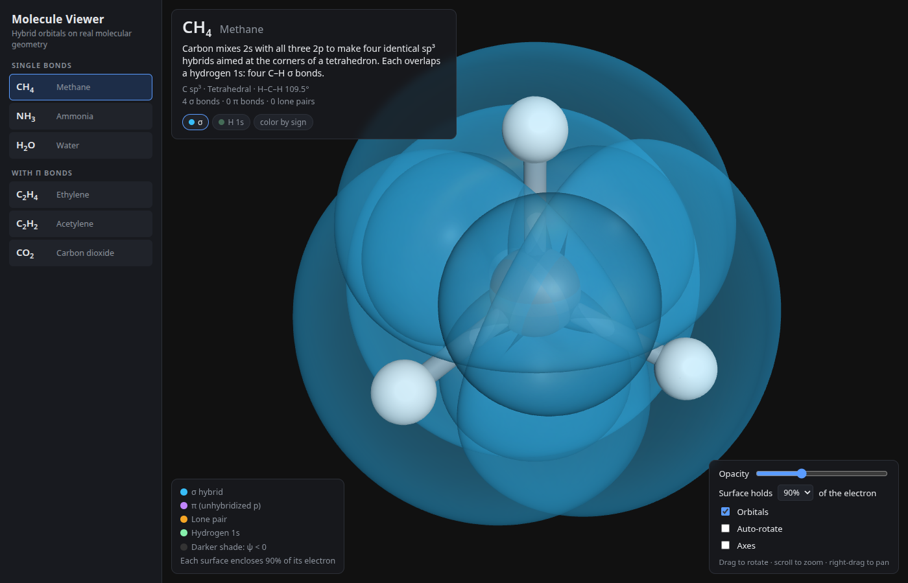
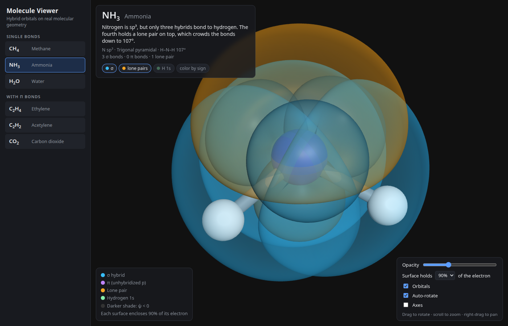
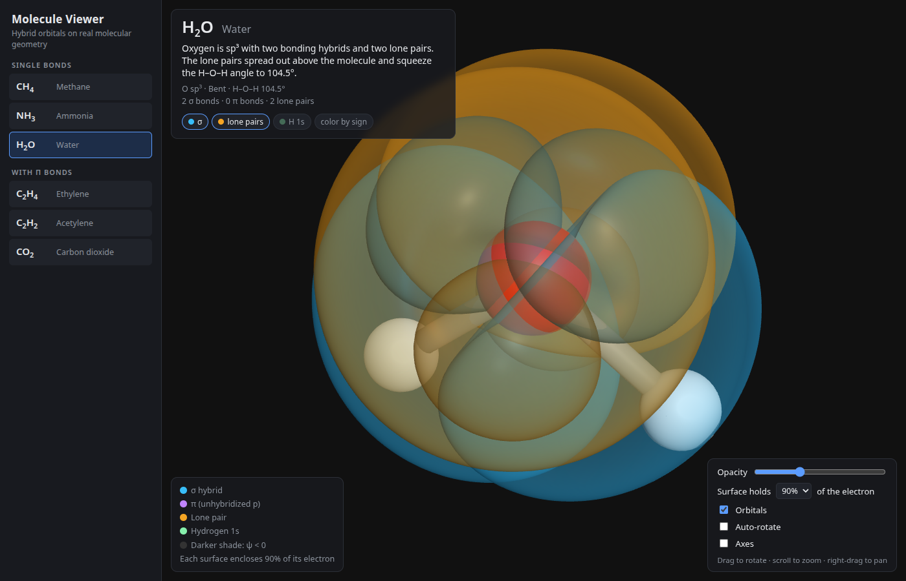
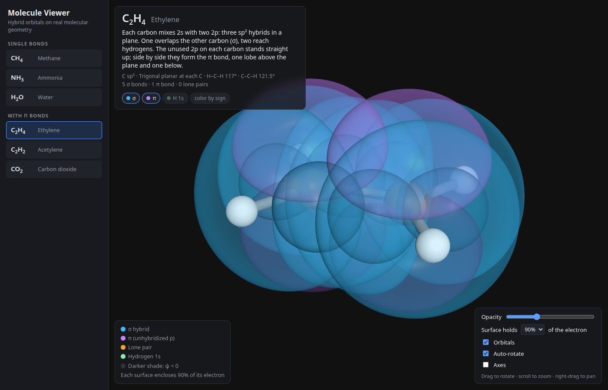
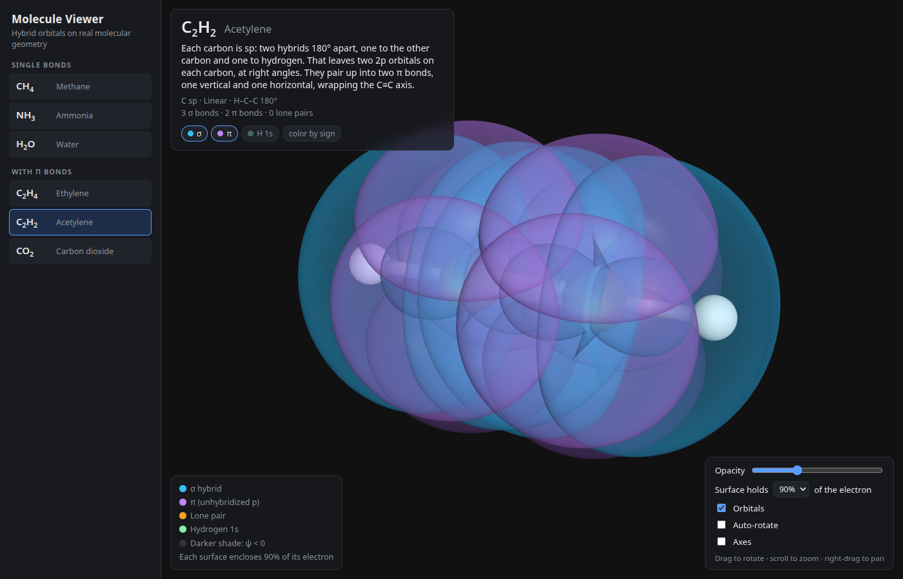
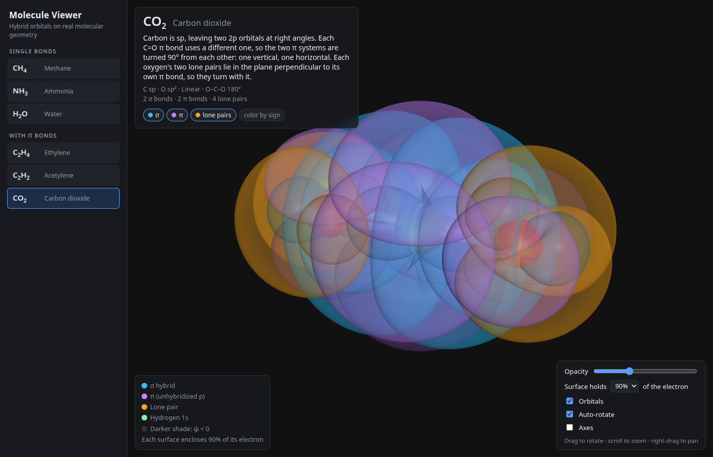

# Molecule Viewer

An interactive 3D viewer that overlays **hybrid orbitals on real molecular
geometry**. Translucent sp³, sp², and sp lobes sit on an accurate ball-and-stick
framework, so you can see why methane is tetrahedral, water is bent, and carbon
dioxide is linear. Part of a small chemistry visualization suite, alongside the
[Electron Orbital Viewer](https://github.com/jfblanchard/electron-orbital-viewer)
and [Crystal Viewer](https://github.com/jfblanchard/crystal-viewer).

## Try it live

**<https://molecule-viewer.pages.dev>**

## Screenshots

| CH₄ methane | NH₃ ammonia | H₂O water |
|:---:|:---:|:---:|
|  |  |  |
| **C₂H₄ ethylene** | **C₂H₂ acetylene** | **CO₂ carbon dioxide** |
|  |  |  |

## What's included

| Molecule | Hybridization | Shape | Angle |
|---|---|---|---|
| CH₄ | C sp³ | Tetrahedral | H–C–H 109.5° |
| NH₃ | N sp³ | Trigonal pyramidal | H–N–H 107° |
| H₂O | O sp³ | Bent | H–O–H 104.5° |
| C₂H₄ | C sp² | Trigonal planar at each C | H–C–H 117° |
| C₂H₂ | C sp | Linear | H–C–C 180° |
| CO₂ | C sp, O sp² | Linear | O–C–O 180° |

- **σ hybrids, lone pairs, and π bonds**, each toggleable, plus hydrogen 1s and
  back lobes.
- **Surface level**: each lobe encloses 50%, 75%, 90%, or 95% of its electron.
- **Color by sign** of the wavefunction, opacity, axes, and auto-rotate.
- **Deep links**: `#ch4`, `#nh3`, `#h2o`, `#c2h4`, `#c2h2`, `#co2`.

## The physics

Orbitals are real hydrogen-like wavefunctions (associated Laguerre radial parts,
real signed spherical harmonics) with Slater effective charges, meshed as
isosurfaces off the main thread. Hybrid s-character comes from the actual bond
angles via Coulson's theorem, so water's O–H hybrids are 20% s and its lone
pairs 30% s rather than a flat 25%. Bond lengths and angles are experimental.

## Run locally

```bash
cd deploy
python3 -m http.server 8000
# open http://localhost:8000   (a server is required for ES modules)
```

To deploy your own copy to Cloudflare Pages:

```bash
cd deploy
npx wrangler pages deploy . --project-name <your-project-name>
```

## Tests

```bash
cd deploy
node --test test_molecules.mjs
```

Checks bond lengths and angles against experiment, orthonormality of every
hybrid set, that each σ hybrid peaks along its bond, lone-pair placement, and
the orientation of every π system.

## Layout

```
deploy/   self-contained web app, the deploy unit (see deploy/README.md)
assets/   README screenshots
```

## License / source

Source: <https://github.com/jfblanchard/molecule-viewer>

MIT License (see LICENSE).
